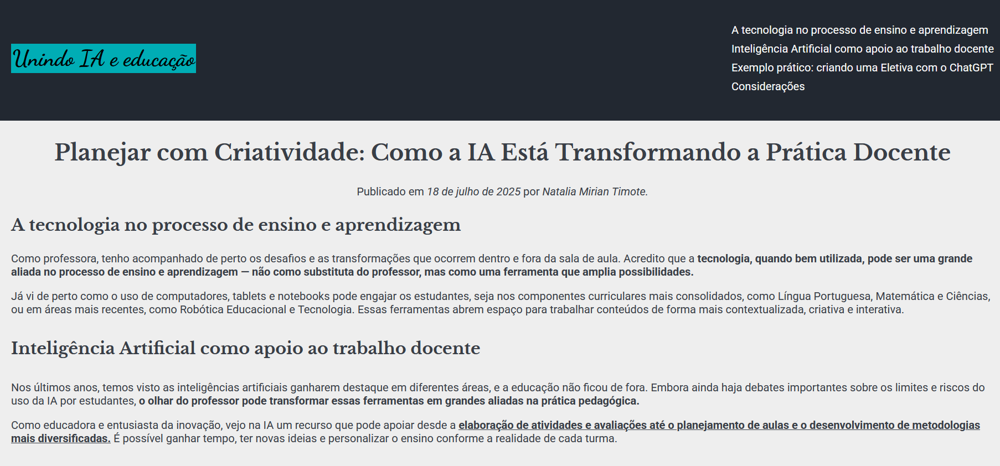
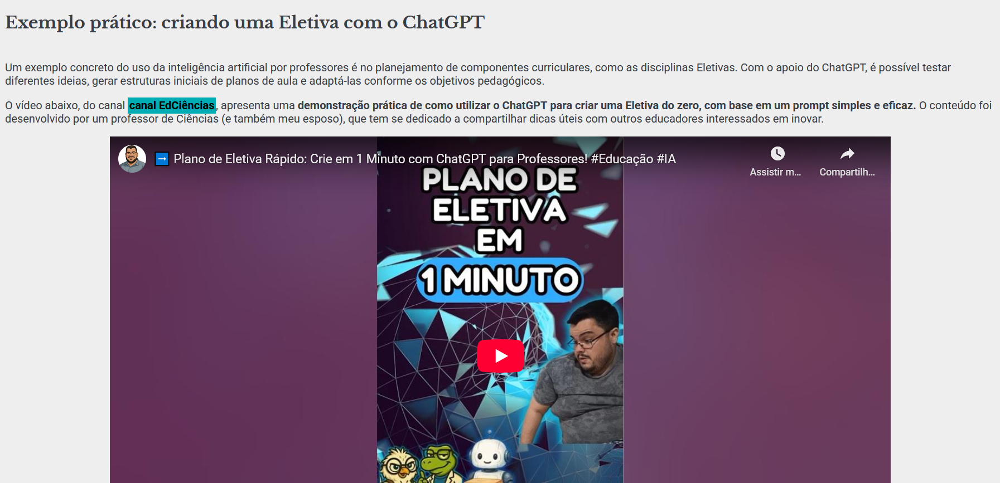

## 💡 Unindo IA e Educação

O **Unindo IA e Educação** é um site simples e informativo que discute o papel da **inteligência artificial no processo educacional**, destacando como essa tecnologia pode apoiar o trabalho docente, tornar o planejamento mais criativo e contribuir com o desenvolvimento de aulas mais personalizadas. Criado como parte de um desafio prático do **bootcamp Santander 2025 (DIO)**, o projeto utiliza diversas **tags semânticas HTML** para estruturar o conteúdo de forma clara, acessível e responsiva.

## 🚀 Sobre o Projeto

Este projeto foi desenvolvido como parte do desafio prático do bootcamp:

* "Santander 2025 - Front-End"

A proposta consistia em construir uma página HTML completa utilizando as **tags aprendidas no curso**. Neste projeto, o foco foi discutir de forma simples e prática **como a inteligência artificial pode apoiar o trabalho docente** na criação de aulas mais criativas e eficientes. Além do conteúdo textual, o site inclui **vídeo incorporado**, uso de tags como <mark>, <blockquote>, <time>, listas, links âncora e cabeçalhos hierárquicos.

## 📚 Objetivos do Desafio

* Utilizar corretamente as principais **tags semânticas HTML5**;
* Aplicar recursos de marcação como **<strong>, <i>, <u>, <blockquote>, <mark> e listas ordenadas/não ordenadas**;
* Criar uma página completa, acessível e organizada.

## 🛠️ Tecnologias Utilizadas

## 🖼️ Visualização do Projeto

Uma prévia das principais funcionalidades do **Unindo IA e Educação**:

**🌐 Acesse o Projeto Online**

O projeto está disponível para visualização na **Vercel**. Clique no link abaixo para acessar:

**📄 Página Inicial**

Destaque do título e navegação com links âncora.

**🎓 Exemplo Prático com ChatGPT**

Vídeo incorporado do canal EdCiências com exemplo de uso real do ChatGPT na construção de disciplinas Eletivas.

